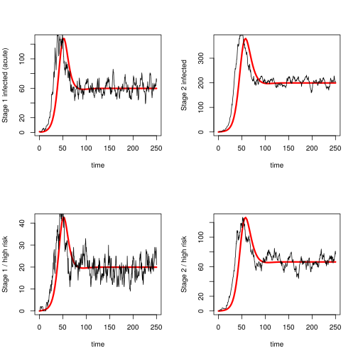
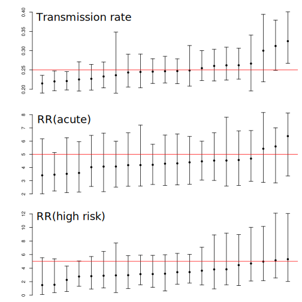
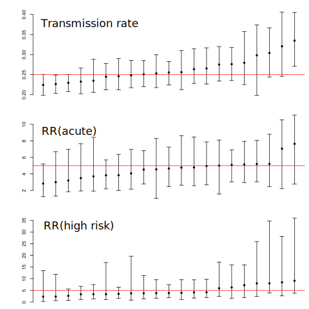

# Simulation set 1

These simulations describe an SIRS epidemic with two risk groups and two stages of infection for a total of four demes. The transmission rate varies between all demes.
For a description of the model, see the manuscript: [https://www.biorxiv.org/content/early/2018/04/10/268052](https://www.biorxiv.org/content/early/2018/04/10/268052)

Twenty simulations are carried out with 2000 initial susceptible and sampling 250 lineages for a long period following epidemic peak. 

Four parameters are estimated
* Transmission rate for SIR dynamics
	- True value = .25 
* Transmission risk ratio for 1st stage of infection ('acute')
	- True value = 5
* Transmission risk ratio for the high risk group 
	- True value = 5
And a 'nuisance' parameter
* Initial number infected 


## Reproducing results 

Results can be reproduced with the following steps: 
1) Simulate the epidemic history: 
```
python sir.py 5 5 2000 250
```
Simulates up to time=250 with 2000 initial susceptible individuals and a transmission risk ratio=5 for the first stage of infection('acute') and the high risk group. 

2) Sample genealogies:
```
Rscript sample.tree.R <simulation id> 250 100
```
Samples 250 individuals starting at time 100

3) Generate an XML file for BEAST:
```
Rscript genxml0.1.R <path to simulations> <simulation id> beast_template0.xml beast0.log;
Rscript genxml0.1.R <path to simulations> <simulation id> beast_template0.xml beast1.log;
```
The template file provides the spec's for different types of analyses. In this case we are comparing analyses with
* `solvePL=false` Fast variation of structured coalescent but makes additional approximations
* `solvePL=true` Slower / more accurate version
The last argument is the file name of the output produced by BEAST> 

4) Run BEAST with the generated XML: `beast <path to xml>`

# Analysing output 
We summarise output from 20 simulations.
```
Rscript a0.beast.R
```


This shows an example simulation trajectory with a deterministic ODE approximation (red): 



Note that BEAST will fit the ODE model which can potentially introduce bias. 

Estimates are similar using the two methods. Using the *fast* method: 



Using the *slow* method: 



We see very low bias with the *slow* version:
```
[1] "beta" # transmission rate / truth = .25
   Min. 1st Qu.  Median    Mean 3rd Qu.    Max. 
 0.1777  0.2348  0.2549  0.2632  0.2819  0.4706 
RMSE 
[1] 0.04173989


[1] "wacute" # risk ratio acute  / truth = 5
   Min. 1st Qu.  Median    Mean 3rd Qu.    Max. 
 0.3241  3.3210  4.4200  4.6840  5.8050 13.4300 
RMSE 
[1] 1.867688


[1] "wrisk2" # risk ratio high risk group  / truth = 5
    Min.  1st Qu.   Median     Mean  3rd Qu.     Max. 
 0.05169  2.86600  4.38800  5.71600  7.04900 48.97000 
RMSE 
[1] 4.800657
```

There is more bias with the *fast* version, but also lower RMSE
```
[1] "beta"
   Min. 1st Qu.  Median    Mean 3rd Qu.    Max. 
 0.1610  0.2269  0.2468  0.2540  0.2716  0.5370 
RMSE 
[1] 0.03855796

[1] "wacute"
   Min. 1st Qu.  Median    Mean 3rd Qu.    Max. 
  1.281   3.538   4.308   4.447   5.213  10.060 
RMSE 
[1] 1.347229

[1] "wrisk2"
     Min.   1st Qu.    Median      Mean   3rd Qu.      Max. 
 0.000742  2.347000  3.309000  3.629000  4.545000 23.010000 
RMSE 
[1] 2.402002
```

Coverage with both methods is appears good for all parameters. 
